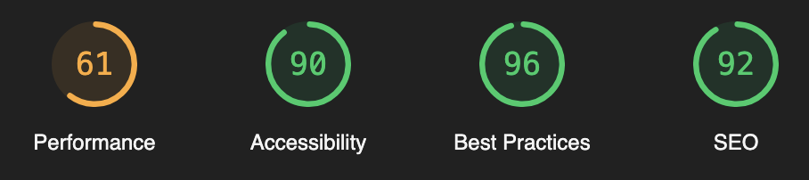

## 🎧 Carver Music

- [카버뮤직](https://music.divdivdiv.com)은 음반 정보 및 리뷰를 제공하는 음악 블로그 사이트입니다.
- 미리보기 GIF 이미지를 포함한 자세한 내용은 [포트폴리오 페이지](https://rust-ocicat-1b0.notion.site/f61c9cea780144819507bf0616d3bd70?pvs=74)에서 확인하실 수 있습니다.
  

## 🧚‍♂️ Overview

- 장르별 게시판
- 음반별 포스트 페이지 제공
- 검색 및 태그 기능
- 무한 스크롤 및 페이지네이션
- BlurHash를 통한 이미지 최적화
- MongoDB로 REST API 구축
- 관리자 루트(/admin)에서 콘텐츠 업로드/수정/삭제
- SSR을 통해 초기 데이터 조회 API 호출

## ⚙️ How to use

사용한 `npm` 버전은 9.2.0이며, `Node.js` 버전은 v19.4.0입니다.

```bash
npm install
npm run dev
```

## ⚒️ Tech stacks

- TypeScript
- React
- Next.js
  - 페이지 로딩 속도 향상을 위한 SSR을 위해 도입
- MongoDB
  - 데이터 저장 및 조회를 위해 도입
- [Jotai](https://jotai.org/)
  - props drilling을 방지하기 위해 도입
- Vercel
  - Next.js 프로젝트의 자동 최적화를 위해 도입

## 🧞‍♂️ Packages

- [react-intersection-observer](https://www.npmjs.com/search?q=react-intersection-observer)
  - 대상의 교차점을 감지
  - 무한 스크롤 기능 구현을 위해 도입
- [react-hook-form](https://www.npmjs.com/package/react-hook-form)
  - 폼 데이터를 용이하게 다루기 위해 도입
- [react-toastify](https://www.npmjs.com/package/react-toastify)
  - 사이트의 각종 알림을 애니메이션으로 표시
  - 관리자 페이지의 사용자 경험 향상을 위해 도입
- [react-blurhash](https://www.npmjs.com/package/react-blurhash)
  - 이미지가 완전히 로딩되기 전까지 블러 버전을 표시
  - 이미지 최적화를 위해 도입
- [react-datepicker](https://www.npmjs.com/package/react-datepicker)
  - 달력 UI로 날짜를 선택
- [rc-rate](https://www.npmjs.com/package/rc-rate)
  - 별점 UI로 스코어를 선택

## 🗄️ Docs

- [트러블 슈팅 모음](https://medium.com/@icycyi92/%EC%B9%B4%EB%B2%84%EB%AE%A4%EC%A7%81-%ED%8A%B8%EB%9F%AC%EB%B8%94-%EC%8A%88%ED%8C%85-%EB%AA%A8%EC%9D%8C-4b296a4ae616)
- [포트폴리오](https://rust-ocicat-1b0.notion.site/f61c9cea780144819507bf0616d3bd70?pvs=4)

## 👨‍💻 Developer

- [Carver](https://github.com/minumsa)
