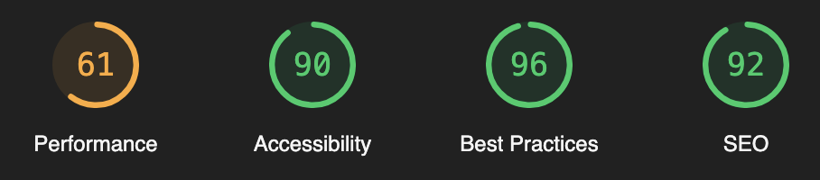

## 🎧 음악 취향 공유 서비스 웹, 카버뮤직

| 메인 페이지                                 |
| ------------------------------------------- |
|  |

- 배포 URL: https://music.divdivdiv.com

## 프로젝트 소개

- 카버뮤직은 음반에 관한 글을 작성하고 별점을 통해 평가하는 등, 자신의 음악 취향을 아카이빙 할 수 있는 사이트입니다.
- 회원가입 및 로그인 기능을 제공합니다.
- 관리자 아이디로 로그인하면 글을 자유롭게 쓰거나 수정하고 삭제할 수 있습니다.
- 글 작성 시 음반의 특성에 맞는 태그를 입력해 각각의 태그가 포함된 글을 모아볼 수 있습니다.
- 마음에 드는 게시글에 좋아요를 누르거나 댓글을 작성할 수 있습니다.
- 검색을 통해 특정 키워드가 포함된 글을 찾을 수 있습니다.
- 음악 장르별로 구분된 게시판에서 원하는 장르의 글을 구경해볼 수 있습니다.
- 달력 게시판을 통해 날짜별로 업로드된 글을 한눈에 살펴보고 해당 페이지로 이동할 수 있습니다.

## 개발 환경

- Front-end: HTML, CSS, TypeScript, React, Next.js, Jotai
- Back-end: MongoDB, AWS S3
- 서비스 배포: Vercel
- 커밋 컨벤션
- 코드 컨벤션
- 스프라이트

## 채택한 개발 기술

### React

- 기능별 컴포넌트화를 통해 추후 유지보수와 재사용성을 고려했습니다.
- 레이아웃 컴포넌트를 설계해 사이트의 전체 구조를 일관성 있게 유지하고 디자인 시스템 관리의 효율성을 높였습니다.

### Next.js

- SSR을 통해 서버 컴포넌트에서 데이터 조회 API를 호출해 페이지 로딩 속도를 향상시켰습니다.
- Metadata API로 페이지별 메타데이터를 동적으로 설정해 SEO를 최적화했습니다.

### Jotai

- 컴포넌트에서 props로 데이터를 전달하는 방식의 경우 props drilling 현상이 발생합니다. 이를 방지하기 위해 필요한 컴포넌트에서만 원하는 데이터를 가져다 쓸 수 있는 상태 관리 라이브러리를 도입하게 되었습니다.
- 메인 페이지의 앨범 데이터 및 로그인 데이터를 atom에 저장해 필요한 컴포넌트에서 사용했습니다.
- Redux 대신 Jotai를 채택한 이유
  - React의 useState와 동작 방식이 비슷해 학습비용 측면에서 훨씬 유리했습니다.
  - 특정 atom이 변경될 때, 해당 atom을 참조하는 컴포넌트만 리렌더링되기 때문에 불필요한 리렌더링을 최소화할 수 있습니다.
  - Redux에 비해 훨씬 적은 양의 코드로 작동시킬 수 있습니다.

### MongoDB

- 사이트의 모든 데이터를 MongoDB와 연동해 관련 CRUD 작업을 구축했습니다.
- 클라이언트와 서버 간 데이터 전송에 필요한 비동기 처리 과정을 구현했습니다.

### AWS S3

- 이미지 업로드 시 AWS S3에 저장하고, 파일 URL을 MongoDB와 연동해 사용자 요청 시 이미지를 빠르게 제공했습니다.

### eslint, prettier

- 정해진 규칙에 따라 자동으로 코드 스타일을 정리해 코드의 일관성을 유지했습니다.
- eslint로 코드 품질 관리를, prettier로 코드 포맷팅을 했습니다.

## 프로젝트 실행 방법

사용한 `npm` 버전은 9.2.0이며, `Node.js` 버전은 v19.4.0입니다.

```bash
npm install
npm run dev
```

## 프로젝트 구조

```bash
.
├── README.md
├── .gitignore
├── .prettierrc
├── package-lock.json
├── package.json
├── app
│   ├── (routes)
│   │   ├── [genre]
│   │   ├── admin
│   │   ├── artist
│   │   ├── calendar
│   │   ├── login
│   │   ├── post
│   │   ├── search
│   │   └── signup
│   └── api
│       ├── artist
│       ├── auth
│       ├── aws
│       ├── calendar
│       ├── genre
│       ├── post
│       ├── randomPost
│       ├── search
│       ├── spotify
│       └── tag
├── components
│   ├── @common
│   │   ├── album
│   │   ├── assets
│   │   ├── footer
│   │   └── header
│   ├── artist
│   ├── auth
│   ├── calendar
│   ├── landingPage
│   ├── post
│   │   └── comment
│   ├── search
│   └── upload
│       ├── TagsEditor
│       ├── ToastEditor
│       └── VideoLinksEditor
├── hooks
├── modules
│   ├── api
│   ├── config
│   └── constants
├── models
└── public
    ├── images
    └── svgs

```

## 개발 기간

- 개발 기간: 2023-10 ~ 2024-02
- 리팩토링 기간: 2024-07 ~ 2024-08

## 관련 문서

- [최유일 포트폴리오](https://rust-ocicat-1b0.notion.site/f61c9cea780144819507bf0616d3bd70?pvs=4)

## 페이지별 기능

### [메인 페이지]

- 200개 이상의 전체 게시글 데이터를 앨범아트 형태로 일정량씩 노출합니다.
- SSR을 통해 초기 데이터 조회 API를 호출해 `MongoDB`로부터 Data Fetching 작업을 진행합니다.
- 현재 데이터 중 마지막 항목이 뷰포트 내에 진입하면 CSR을 통해 데이터 조회 API를 호출하는 무한 스크롤 로직이 작동됩니다.
- 새로운 데이터를 불러올 때까지 Loading Spinner를 표시한 뒤, [`AOS`](https://www.npmjs.com/package/aos)의 `fade-in-up` 애니메이션을 활용해 화면을 부드럽게 전환시킵니다.
- 데이터 조회 API를 통해 한번 불러온 데이터는 `Jotai` atom에 저장해두었다가 재사용합니다.

| 메인 페이지                                 |
| ------------------------------------------- |
|  |

<br>

### [메인 페이지] - BlurHash

- 이미지가 완전히 로딩될 때까지 잠시 비어 있는 상태로 표시되는 문제를 해소하기 위해 도입했습니다.
- `BlurHash` 라이브러리를 활용하는 커스텀 훅을 생성했습니다.
- 이미지 로딩 전 해당 이미지의 블러 버전을 표시해 이미지를 최적화합니다.

| 메인 페이지 - BlurHash                          |
| ----------------------------------------------- |
|  |

<br>

### [회원가입 / 로그인 페이지]

- 회원가입 시 비밀번호는 `bcrypt`로 암호화되어 `MongoDB`에 안전하게 저장됩니다.
- 비밀번호 불일치 및 이미지 파일 크기 제한 등 유효성 검사 기능을 구현했습니다.
- 프로필 이미지 파일의 경우 `AWS S3`에 별도로 저장합니다.
- 로그인 시 서버에서 발급한 `JWT`를 HTTP 쿠키에 저장해 인증 정보를 관리합니다.
- 쿠키는 `HttpOnly` 및 `Secure` 플래그를 설정해 보안을 강화했습니다.

| 회원가입 / 로그인 페이지                      |
| --------------------------------------------- |
|  |

<br>

### [장르 페이지]

- 장르별 게시글에 관한 요약 정보를 제공하는 게시판 역할을 수행합니다.
- CSR을 통해 데이터 조회 API를 호출하는 페이지네이션 로직을 구현했습니다.
- 페이지당 5건의 게시글을 표시합니다.

| 장르 페이지                                   |
| --------------------------------------------- |
|  |

<br>

### [포스트 페이지]

- 게시글의 메타데이터 및 상세정보를 표시합니다.
- `Next.js`의 `Dynamic Routes` 기법을 통해 게시글 ID로 경로([/post](https://music.divdivdiv.com/post/0S0KGZnfBGSIssfF54WSJh)/postID)를 지정합니다.
- `Next.js`의 `Metadata API`로 페이지별 메타데이터 생성합니다.
- `AWS S3`에 포스트 이미지 데이터를 저장하고, 해당 이미지를 불러와 표시합니다.
- `LightHouse`로 측정한 SEO 점수 90점을 기록했습니다.

| 포스트 페이지                               |
| ------------------------------------------- |
|  |

<br>

### [포스트 페이지] - 댓글

- 유저 데이터를 활용해 댓글과 답글, 좋아요 기능을 구현했습니다.
- 로그인 시에만 사용 가능하고, 로그인되지 않은 상태에서 해당 동작을 수행하려고 하면 예외 처리되어 로그인 페이지로 이동할 수 있는 팝업창을 표시합니다.
- 댓글을 조회할 때는 게시글의 앨범ID와 일치하는 데이터를 `MongoDB`에서 전달해줍니다.

| 포스트 페이지 - 댓글                          |
| --------------------------------------------- |
|  |

<br>

### [검색 / 태그 페이지]

- 검색어나 활성화된 태그에 관련된 게시글 표시합니다.
- 검색어를 입력하거나 태그를 클릭하면 해당 키워드를 파라미터로 사용하는 데이터 조회 API를 호출하고, 일치하는 데이터를 `MongoDB`에서 가져옵니다.
- 검색 결괏값이 없는 경우 예외 처리되어 관련 메시지를 별도로 표시합니다.

| 검색 / 태그 페이지                                 |
| -------------------------------------------------- |
|  |

<br>

### [달력 페이지]

- 달력 형태로 전체 게시글을 표시해 업로드 날짜별 게시글을 직관적으로 확인할 수 있는 UI를 제공합니다.
- `MongoDB`의 쿼리 기능을 활용해 작성일을 기준으로 필터링하고, 월별 게시글 데이터를 가져옵니다.
- 달력에서 특정 앨범아트를 클릭 시 날짜별 디테일 페이지로 이동합니다.
- 하루에 업로드된 게시글이 2건 이상일 때, 앨범아트 우측 상단에 총 데이터 수를 표시합니다.

| 달력 페이지                                         |
| --------------------------------------------------- |
|  |

<br>

### [관리자 페이지]

- 관리자 아이디로 로그인 시 `JWT`를 검사하고, 관리자가 맞다면 관리자 페이지(/admin)로 이동합니다.
- 관리자 페이지에서는 게시글을 수정하거나 삭제할 수 있는 UI를 별도로 제공합니다.
- 업로드 페이지는 관리자 페이지의 일부로 관리자만 이용 가능하며, 앨범 제목 input에 키워드를 입력하면 Spotify API를 통해 관련 앨범을 검색하고, 원하는 앨범을 클릭 시 해당 데이터가 입력됩니다.

| 관리자 페이지                                 |
| --------------------------------------------- |
|  |

<br>

### [모바일 페이지]

- `CSS` 미디어 쿼리를 통해 사용자의 현재 뷰포트 크기에 따라 적합한 스타일을 적용합니다.

| 모바일 페이지 1                                   | 모바일 페이지 2                                   |
| ------------------------------------------------- | ------------------------------------------------- |
|  |  |

## 프로젝트 후기

**REST API 생성 및 관리**
<br>
MongoDB를 통해 REST API를 직접 만들어 활용해보았습니다. 프로젝트에 필요한 CRUD 작업을 구축해 클라이언트와 서버 간의 데이터 전송과 처리 과정을 이해했습니다. 데이터베이스 모델링과 쿼리 작성을 포함한 실전 경험을 통해 프로젝트 내의 간단한 데이터 관리에 자신감을 갖게 되었습니다.

**SSR을 통해 로딩 속도 최적화**
<br>
처음에는 이전 프로젝트와 마찬가지로 Netlify에 사이트를 배포했으나, 데이터 조회 API 속도가 4초 이상 걸리는 문제가 발생했습니다. 이 문제를 해결하기 위해 몇 가지 조치를 취했습니다. 먼저, MongoDB의 캐시된 연결을 재사용하는 기능을 구현하여 중복 연결 시도를 방지했습니다. 또 서버 컴포넌트에서 초기 데이터 조회 API를 호출하는 방식으로 SSR(Server-Side Rendering)을 활용했습니다. 마지막으로, 사이트를 Next.js의 공식 호스팅 플랫폼인 Vercel에 재배포하고, Function Region을 한국으로 설정했습니다. 이러한 최적화 작업 덕분에 데이터를 50개씩 불러올 때, 초기 데이터 조회 API 속도가 호출당 약 0.6초로 단축되었습니다.

**의미 있는 변수명 작성**
<br>
프로젝트를 완성한 지 한 달쯤 뒤에 전체 코드를 살펴볼 기회가 있었는데, 직접 짠 코드인데도 코드의 흐름을 파악하는 데 약간의 어려움이 있었습니다. 이후 리팩토링 작업을 진행하면서 다른 개발자가 보더라도 코드의 의도를 명확히 파악할 수 있도록 변수명을 변경해 코드의 가독성을 향상시켰습니다.

## 트러블 슈팅

- [페이지 로딩 속도 개선](https://github.com/minumsa/carver-music/wiki/%ED%8A%B8%EB%9F%AC%EB%B8%94-%EC%8A%88%ED%8C%85:-%ED%8E%98%EC%9D%B4%EC%A7%80-%EB%A1%9C%EB%94%A9-%EC%86%8D%EB%8F%84-%EA%B0%9C%EC%84%A0)
- [CORS - Preflight Request 에러 해결](https://github.com/minumsa/carver-music/wiki/%ED%8A%B8%EB%9F%AC%EB%B8%94-%EC%8A%88%ED%8C%85:-CORS-%E2%80%90-Preflight-%EC%9A%94%EC%B2%AD-%EC%97%90%EB%9F%AC-%ED%95%B4%EA%B2%B0)
- [API 모듈화](https://github.com/minumsa/carver-music/wiki/%ED%8A%B8%EB%9F%AC%EB%B8%94-%EC%8A%88%ED%8C%85:-API-%EB%AA%A8%EB%93%88%ED%99%94)
- [Spotify API를 활용한 음악 데이터 입력 자동화](https://github.com/minumsa/carver-music/wiki/%ED%8A%B8%EB%9F%AC%EB%B8%94-%EC%8A%88%ED%8C%85:-Spotify-API%EB%A5%BC-%ED%99%9C%EC%9A%A9%ED%95%9C-%EC%9D%8C%EC%95%85-%EB%8D%B0%EC%9D%B4%ED%84%B0-%EC%9E%85%EB%A0%A5-%EC%9E%90%EB%8F%99%ED%99%94)
- [코드 가독성 개선](https://github.com/minumsa/carver-music/wiki/%ED%8A%B8%EB%9F%AC%EB%B8%94-%EC%8A%88%ED%8C%85:-%EC%BD%94%EB%93%9C-%EA%B0%80%EB%8F%85%EC%84%B1-%EA%B0%9C%EC%84%A0)

## 개선 목표

- Lighthouse Performance 향상

  - 현재 모든 페이지에서 Performance 점수가 낮은 편입니다.
  - 원인을 파악해 Performance 점수 뿐만 아니라 Accessibillity 및 SEO 점수도 100점까지 올릴 예정입니다.

|    **Lighthouse Performance**     |
| :-------------------------------: |
|  |

## 개발자

<div>

|                                                                   **최유일**                                                                    |
| :---------------------------------------------------------------------------------------------------------------------------------------------: |
| [ <br/> @minumsa](https://github.com/minumsa) |

</div>
